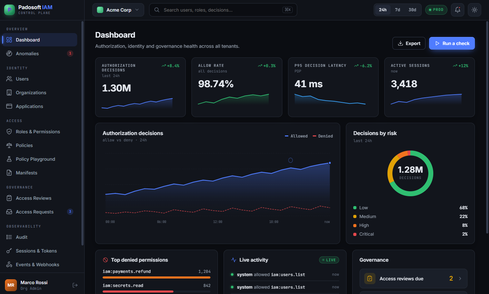
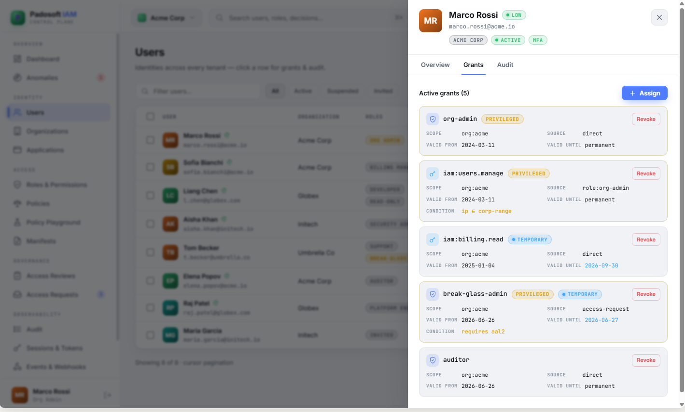
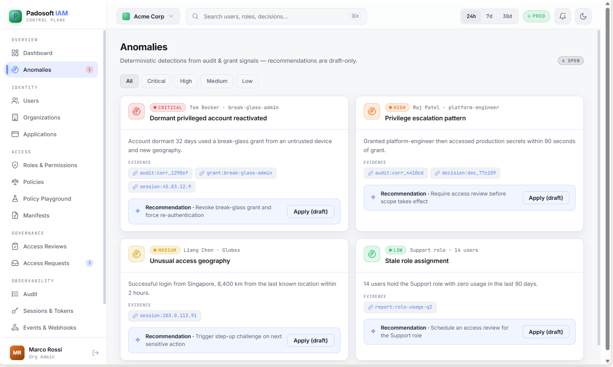
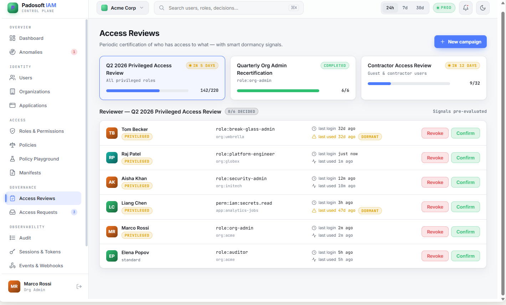

<p align="center">
  
</p>

<h1 align="center">Laravel IAM — Console</h1>

<p align="center">
  <strong>Your own Identity &amp; Authorization control plane, deployable in minutes.</strong><br>
  One Laravel 13 app that installs the entire Laravel IAM ecosystem and ships a web admin console to
  manage users, roles &amp; grants, sessions, audit, access reviews, AI anomaly recommendations and apps.
</p>

<p align="center">
  <a href="https://github.com/padosoft/laravel-iam-console/actions"></a>
  
  
  
  
  <a href="LICENSE"></a>
</p>

<p align="center">
  📚 <b><a href="https://doc.laravel-iam-server.padosoft.com">Full documentation</a></b> &nbsp;·&nbsp;
  🚀 <a href="https://doc.laravel-iam-server.padosoft.com/tutorial">Zero-to-working tutorial</a>
</p>

---

## What this is

`laravel-iam-console` is the **deployable host application** for [Laravel IAM](https://github.com/padosoft).
Instead of wiring a dozen packages by hand, you clone this app, point it at a database, deploy it (e.g. on
**Laravel Cloud**), seed a super-admin — and you have a running **Identity &amp; Authorization server** with a
web console. Your other apps then install [`padosoft/laravel-iam-client`](https://github.com/padosoft/laravel-iam-client)
and ask it for authorization decisions.

It bundles the **whole ecosystem in one app**:

| Package | Role | Docs |
| --- | --- | --- |
| [laravel-iam-server](https://packagist.org/packages/padosoft/laravel-iam-server) | Identity, PDP (RBAC+ABAC+ReBAC), OAuth/OIDC, tamper-evident audit, governance, **Admin API** | [doc →](https://doc.laravel-iam-server.padosoft.com) |
| [laravel-iam-client](https://packagist.org/packages/padosoft/laravel-iam-client) | `iam.auth` / `iam.can` middleware + Gate adapter | [doc →](https://doc.laravel-iam-client.padosoft.com) |
| [laravel-iam-ai](https://packagist.org/packages/padosoft/laravel-iam-ai) | Advisory-only AI governance (redaction + hallucination-guard) | [doc →](https://doc.laravel-iam-ai.padosoft.com) |
| [laravel-iam-directory](https://packagist.org/packages/padosoft/laravel-iam-directory) | LDAP/AD login + JIT provisioning | [doc →](https://doc.laravel-iam-directory.padosoft.com) |
| [laravel-iam-bridge-spatie-permission](https://packagist.org/packages/padosoft/laravel-iam-bridge-spatie-permission) | Migration bridge from spatie/laravel-permission | [doc →](https://doc.laravel-iam-bridge-spatie-permission.padosoft.com) |
| [laravel-iam-contracts](https://packagist.org/packages/padosoft/laravel-iam-contracts) | Shared interfaces &amp; DTOs (dependency root) | [doc →](https://doc.laravel-iam-contracts.padosoft.com) |

The polyglot client SDKs — [node](https://www.npmjs.com/package/@padosoft/laravel-iam-node),
[react-native](https://www.npmjs.com/package/@padosoft/laravel-iam-react-native),
[rust](https://crates.io/crates/laravel-iam) — connect to the server this app runs.

## Why it's different

- **One deploy, whole control plane.** Server + client + AI + directory + Spatie bridge, booted and migrated
  together. No glue code.
- **Fail-closed by design.** Every decision is the PDP's; every Admin API route is gated by a permission and
  denies on any uncertainty.
- **Session-authenticated console.** The React admin panel talks to the Admin API using your Fortify login
  session — no tokens to juggle in the browser. Authorization is still the PDP's call, per route.
- **Runs on a database and nothing else.** No Redis, no S3 required: sessions/cache/queue on the database,
  ES256 signing keys generated and stored locally. Add Redis/KMS only at scale.
- **Tamper-evident audit** and **AI anomaly recommendations** built in — not bolt-ons.

## The console

<p align="center"></p>

<table>
<tr>
<td width="50%"><br><em>Users &amp; grants — assign roles/permissions</em></td>
<td width="50%"><br><em>Sessions &amp; tokens — revoke live</em></td>
</tr>
<tr>
<td><br><em>Tamper-evident audit log</em></td>
<td><br><em>AI anomaly &amp; least-privilege recommendations</em></td>
</tr>
<tr>
<td><br><em>Access review campaigns</em></td>
<td><br><em>Decision playground — check/explain</em></td>
</tr>
</table>

## Quick start (local)

```bash
git clone https://github.com/padosoft/laravel-iam-console
cd laravel-iam-console

cp .env.example .env
composer install
php artisan key:generate
php artisan migrate            # full iam_* schema (SQLite by default)
php artisan db:seed            # creates the first super-admin (see IAM_SUPERADMIN_* in .env)

# Build the console UI (or `npm run dev` for hot reload)
npm --prefix resources/console install
npm --prefix resources/console run build

php artisan serve
```

Open **<http://localhost:8000>**, sign in with the seeded super-admin
(`admin@example.com` / `password` by default — change it!), and you're managing IAM.

## Deploy from zero on Laravel Cloud

You need only **an app + a database**. No Redis, no object storage.

1. **Push this repo to GitHub** (your fork/copy).
2. **Create a Laravel Cloud project** and connect the repo.
3. **Add a database** (Postgres or MySQL). Laravel Cloud injects the `DB_*` env.
4. **Set environment variables** (Project → Environment):
   ```dotenv
   APP_URL=https://your-iam.example.com
   IAM_ISSUER=https://your-iam.example.com
   IAM_KMS_DRIVER=local
   SESSION_DRIVER=database
   CACHE_STORE=database
   QUEUE_CONNECTION=database
   IAM_SUPERADMIN_EMAIL=you@example.com
   IAM_SUPERADMIN_PASSWORD=a-strong-password
   ```
5. **Build command** — build the SPA and run migrations/seed on deploy:
   ```bash
   composer install --no-dev --optimize-autoloader
   npm --prefix resources/console ci && npm --prefix resources/console run build
   php artisan migrate --force
   php artisan db:seed --class=SuperAdminSeeder --force
   ```
6. **Enable the scheduler** (Laravel Cloud toggle) — drives async audit checkpoints, webhook delivery and
   access-review reminders. That's the only background piece, and it needs no Redis.
7. **Deploy.** Visit your URL, sign in as the super-admin, and register your first application + users.

Then, in each **consuming app**, `composer require padosoft/laravel-iam-client`, point it at this server, and
protect routes with `iam.auth` / `iam.can`. The full walkthrough — creating this server, users, an app and
connecting a client — is the [zero-to-working tutorial](https://doc.laravel-iam-server.padosoft.com/tutorial).

## Creating the first super-admin

There is no wildcard permission in the PDP, so a **super-admin is a user granted every `iam:*` permission**.
`SuperAdminSeeder` does exactly that (idempotent). Credentials come from env:

```dotenv
IAM_SUPERADMIN_NAME="Super Admin"
IAM_SUPERADMIN_EMAIL=admin@example.com
IAM_SUPERADMIN_PASSWORD=change-me-now
```

```bash
php artisan db:seed --class=SuperAdminSeeder
```

From there the super-admin creates other users (in the console) and grants them scoped roles/permissions.

## Architecture notes

- **Login backend:** [Laravel Fortify](https://laravel.com/docs/fortify) (username/password). Passkeys
  (`laravel/passkeys`) are deferred until `web-auth/webauthn-lib` supports Symfony 8 (Laravel 13).
- **Session-authenticated Admin API:** the server's Bearer auto-registration is disabled and the Admin API is
  re-served under the `web` group; `App\Iam\SessionAdminActorResolver` resolves the actor from the Fortify
  session. See [`CLAUDE.md`](CLAUDE.md).
- **Console SPA:** React 19 + Vite + Tailwind in `resources/console`, built into `public/console`, talking
  only to the real Admin API.

## License

MIT © [Padosoft](https://www.padosoft.com). Part of the [Laravel IAM](https://github.com/padosoft) ecosystem.
